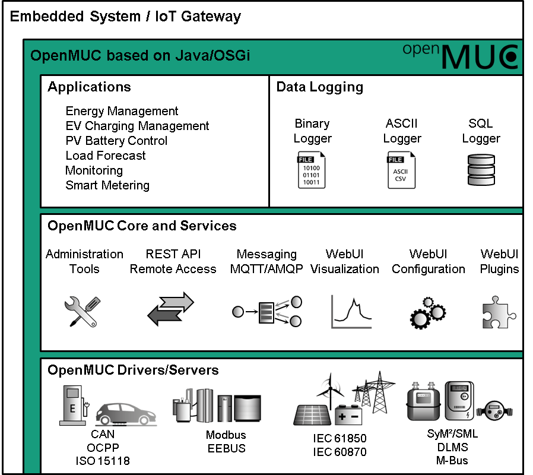

# OpenMUC Framework - Overview 

This is UNOFFICIAL, fork from [openmuc](http://www.openmuc.org/openmuc/).

## OpenMUC
OpenMUC is a software framework based on Java and OSGi that simplifies the development of customized **monitoring, logging and controlling** systems. It can be used as a basis to flexibly implement anything from simple data loggers to complex SCADA systems. The main goal of OpenMUC is to shield the application developer of monitoring and controlling applications from the details of the communication protocol and data logging technologies. Third parties are encouraged to create their own customized systems based on OpenMUC. OpenMUC is licensed under the GPL. We sell individual licenses on request.

## Features
In summary OpenMUC features the following highlights:

- Easy application development
  - OpenMUC offers an abstract service for accessing data. Developers can focus on the application’s logic rather than the details of the communication and data logging technology.
- Simple and flexible configuration
  - All communication and data logging parameters can be dynamically configured through a central file, the framework’s configuration service or a web interface.
- Communication support
  - Out of the box support for several popular communication protocols. New communication protocol drivers can easily be added through a plug-in interface. Existing protocol drivers:
    - Modbus TCP / Modbus RTU / Modbus RTU/TCP
    - IEC 61850
    - IEC 60870-5-104
    - IEC 62056-21
    - DLMS/COSEM
    - KNX
    - M-Bus (wired)
    - wireless M-Bus
    - eHz meters/SML
    - REST/JSON
    - SNMP
    - CSV
    - AMQP
- Data logging
  - Data can be logged in different formats. New data loggers can easily be added through a plug-in interface. Existing logger:
    - ASCII
    - AMQP
    - MQTT
    - SlotsDB (binary)
- Messaging
  - Supports message queue technologies like AMQP and MQTT to publish measurements to a broker and subscribe to control commands
- Web interface
  - Convenient user interface for configuration and visualization. Existing WebUI applications:
    - Channel Access Tool
    - Channel Configurator
    - Data Exporter
    - Data Plotter
    - Media Viewer
- Data servers
  - Remote applications (e.g. smart phone apps, cloud applications) or local non-Java applications can access OpenMUC through one of the available data servers. Existing server:
    - Modbus TCP
    - REST/JSON
- Modularity
  - Drivers, data loggers etc. are all individual components. By selecting only the components you need you can create a very light weight system.
- Embedded systems
  - The framework is designed to run on low-power embedded devices. It is currently being used on embedded x86 and ARM systems. Because OpenMUC is based on Java and OSGi it is platform independent.
- Open-source
  - The software is being developed at the Fraunhofer Institute for Solar Energy Systems in Freiburg, Germany and is licensed under the GPLv3. We sell individually negotiated licenses upon request.

## Architecture
The following picture illustrates how OpenMUC works.

OpenMUC framework overview

All boxes seen in the picture are implemented as software modules called OSGi bundles that run independently in the OSGi environment. All modules except for the Data Manager are optional. Thus by selecting the modules you need you can easily create your own customized and light weight system. An explanation of these modules can be found in the user guide.

## Developers

  Marco Mittelsdorf, Dirk Zimmermann, Jörn Schumann, Martin Eberle

  ### Alumni:

  Stefan Feuerhahn, Michael Zillgith, Albrecht Schall, Simon Fey, Frederic Robra, Karsten Müller-Bier, Philipp Fels

Read the [user guide](https://gythialy.github.io/openmuc/) on how to get started with the library.
